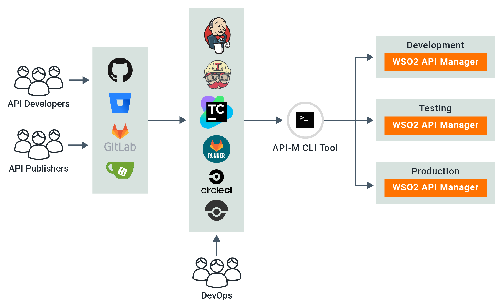
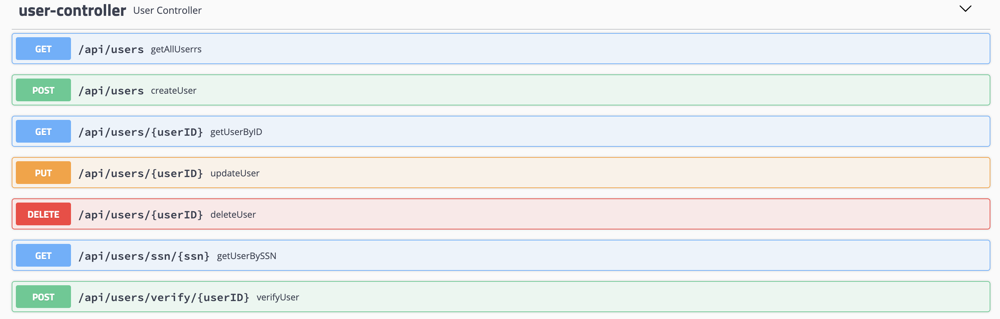

# CICD Pipeline for WSO2 API Manager

## Overview

APIs have become the defacto for connecting apps, services and data. Organizations have multiple environments such as 
Dev, Test and Prod for different purposes. Therefore, the APIs need to be available in each environment after developers 
specify the required conditions. Manually promoting APIs between environments is a tedious, error-prone, and 
time-consuming task. This drastically reduces an organization’s productivity. 

WSO2 API Manager addresses the issue of API automation by providing a platform-agnostic, developer-centric solution. 
WSO2 API Controller, apictl tool plays a key role in the automation pipeline

## Architecture

For this demonstration the following architecture will be used.

## Prerequisites

1. Deploy the backend server
2. Install the Jenkins server
3. Install WSO2 API Manager

### 1. Deploy the backend server

Sample user service is used as the backend server and the complete source code of that server can be found 
[here](backend_server). Note that this is a Spring Boot application and the following commands can be used to start 
or build the application

* Start the application : `mvn spring-boot:run`
* Build the application : `mvn clean install`

Note that the jar is already built and stored [here](backend_server/target/backend-server-1.0.0.jar) and that can be 
simply started by executing `java -jar target/backend-server-1.0.0.jar`

All the available services will be shown in the Swagger UI.

Swagger UI URL: [http://localhost:8595/swagger-ui.html]()

### 2. Install the Jenkins server

Installing jenkins server is straight forward. Please refer to their official [documentation](https://www.jenkins.io/doc/book/installing/)
for this.

### 3. Install WSO2 API Manager

Installing WSO2 API Manager is straight forward and please refer to this [documentation](https://apim.docs.wso2.com/en/latest/install-and-setup/install/installing-the-product/installing-the-product/)
for more information on that. For this demonstration I'll be having two environments called Dev and Test but any number 
of environments can be there and the steps are pretty much the same.

## Configurations

##### API Project
* For this demo, I have created an API called UserAPI and the API project can be found [here](/apim_artifacts/UserAPI)
* Once this project is cloned, this can be deployed on your development API Manager server by simply running the apictl 
tool. The CTL tool can be downloaded and installed by following [this documentation.](https://apim.docs.wso2.com/en/next/learn/api-controller/getting-started-with-wso2-api-controller/)
* Execute the below commands to deploy this API on your development server. If your devlopment server is not on the local machine, 
please change the URLs accordingly.

    * Add the dev environment : `apictl add-env -e dev --apim https://localhost:9443 --token https://localhost:8243/token`
    * Login to the dev environment : `apictl login dev -u admin -p admin -k`
    * Import the UserAPI to the dev environment : `apictl import-api -f APIM_CICD/apim_artifacts/UserAPI e dev -k --preserve-provider --update —verbose`

* Now you can log into the dev environment and do any kind of modifications to the UserAPI.
* If you want to export the API from the dev environment, the following commands can be used

    * Add the dev environment : `apictl add-env -e dev --apim https://localhost:9443 --token https://localhost:8243/token`
    * Login to the dev environment : `apictl login dev -u admin -p admin -k`
    * Export the UserAPI from the dev environment : `apictl export-api -n UserAPI -v v1 -e dev -k`

#### Jenkins Server
1. Login to the jenkins server. You might have to create a user if this is the first time.
2. Install [npm and nodejs plugins](https://wiki.jenkins.io/display/JENKINS/NodeJS+Plugin) 
and [Newman](https://learning.getpostman.com/docs/postman/collection-runs/integration-with-jenkins/#installation) globally in your Jenkins server. 

Newman is used to run the tests I have created using PostMan. The test script can be found [here](apim_artifacts/test_script.postman_collection.json).
3. Download and configure [WSO2 API Controller](https://wso2.com/api-management/tooling/) to the Jenkins server and the developer machines.

Note that you need to add the environments properly to the API Controller in the Jenkins Server. You can add environments 
by either manually editing the `<USER_HOME>/.wso2apictl/main_config.yaml` file or by running the following CTL command. 
Don't forget that usually jenkins create a new user called *jenkins* and the environment should be added to that user or else 
jenkins server won't notice this. The same commands mentioned in the above topic can be used for this.
4. Now we need to create a GitHub repository and later we are planning to push [apim_artifacts](apim_artifacts) folder to that repo.
5. Once the repo is created, let's configure the webhook. This is how the jenkins server will get notified when ever there is a new commit.
. 
Note that the url has to be passed here and if the Jenkins is deployed locally, then you can use [ngrol](https://ngrok.com/) 
to expose your localhost through internet.
6. Let's commit the [apim_artifacts](apim_artifacts) to this newly created repo.
7. Store the GitHub and APIM user credentials on Jenkins. Note that this can be done more securely using GitHub Apps.

8. Add the Jenkins pipeline configuration defined in [here](jenkinsfile). Don't forget to change the GitHub url accordingly.

#### Trigger the pipeline
* You can start the pipeline manually by clicking on the *Build Now* button and all the stages should be passed.
* Now let's do a small change and commit it to the repo. Jenkins should pick that change via the webhook and the job should be started.
