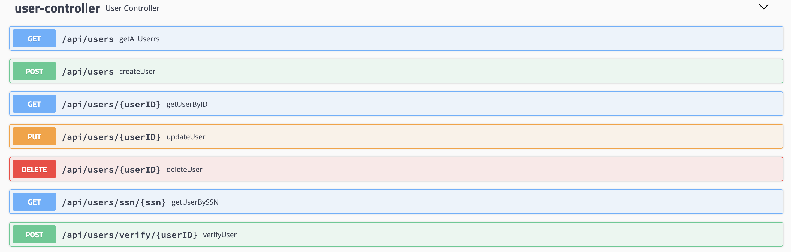

# Backend Server

Sample user service is used as the backend server and the complete source code is available here. Note that this is a Spring Boot application and the following commands can be used to start 
or build the application

* Start the application : `mvn spring-boot:run`
* Build the application : `mvn clean install`

Note that the jar is already built and stored [here](target/backend-server-1.0.0.jar) and that can be 
simply started by executing `java -jar target/backend-server-1.0.0.jar`

All the available services will be shown in the Swagger UI.

Swagger UI URL: [http://localhost:8595/swagger-ui.html]()

